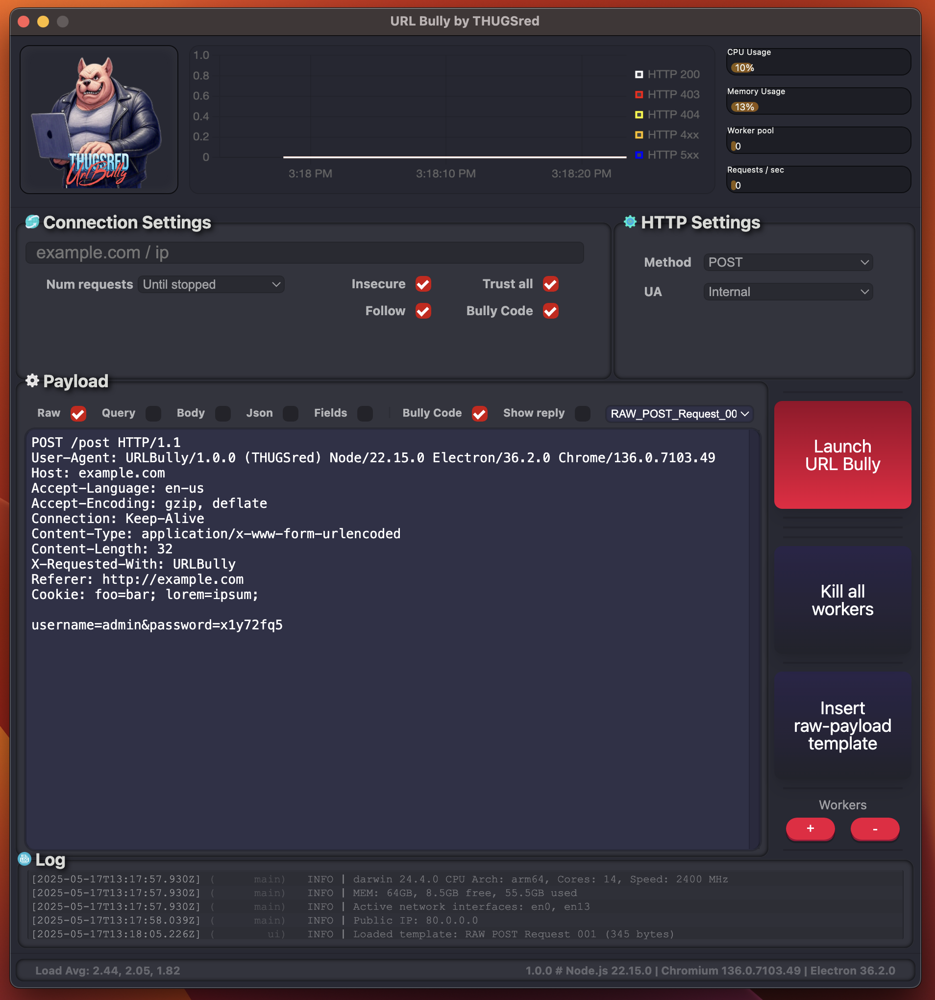

# ᵔᴥᵔ UrlBully - a THUGSred tool!

[](https://twitter.com/davidbl) [](https://github.com/kawaiipantsu/urlbully/issues) [](https://github.com/kawaiipantsu/urlbully/issues) [](https://github.com/kawaiipantsu/urlbully/blob/master/LICENSE) [](https://github.com/kawaiipantsu/urlbully/network) [](https://github.com/kawaiipantsu/urlbully/stargazers)

> In THUGSred (red-team) we use all sorts of tools and scripts, many home-grown just as this one. There might not be anything revolutionary about it, typically it simply solves a need we have at a givin task/problem. In this case, i often find myself quickly wanting to create some "spam" options for grabbing URL's via HTTP machanics but it always ends up with me creating new small scripts for each task - This tool solves that ʘ‿ʘ

[](https://github.com/kawaiipantsu/urlbully)


# PLEASE BE AWARE - It's in early stages!
> It's getting more and more polished!
> Can't wait to actually begin making some of the engine logic...

URL Bully is a simple tool to bully a webserver on the URL level, it's a UI for when you don't want to script your way out of things! Basically a simple web pen-test tool, inspiration from my needs, curl, Burp Suite. Sometimes the most simple approch can yield victims/targets to deescalate their security or break their application.

# Table of Contents

 * [Features](#features)
 * [Screenshot](#screenshot)
 * [THUGSred Community](#thugsred_community)

## Features

- Bully Code (Early alpha)
  - Meaning it supports variables that are replaced like:
  ```json
  {{host}}
  {{base64('string')}}
  {{useragent}}
  {{contentlength}}
  ```
- Context menu
  - Easy access to header manipulation
  - Easy access to encoding / decoding selected text
- Templates
  - Auto switching connection type, http method based on template names
  - Template content can contain Bully Code
  - Will run 2 iterations of Bully Code (pre / post) to catch content-length etc and others
- Live performence graph
- System health monitoring
- Simplistic "log window" to see last 5 messages

These are some of the more noteworty features i have implemented, of course it does a lot more. However it's all very much in construction still! If you want to contribute just join the community and join the conversation :)

## Screenshot

This is just a preview of how the base-app looks at the momment but should give a good indication of how the final tool will look.



## THUGSred Community

### THUGS(red) is a EU/DK community focused on InfoSec, SecOps, Red/Blue-teaming, CTF, DevSecOps
### We also develop tools for SecOps :)

### Discord
- https://discord.gg/Xg2jMdvss9

### THUGSred
- https://thugs.red
